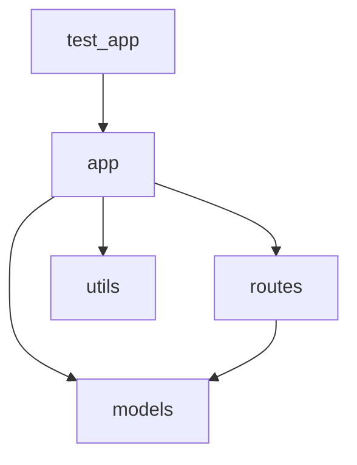

# sample-project — Documentation

> Auto-generated by **DevDoc Intelligence Platform** — AI-powered codebase governance
> Generated: February 11, 2026 at 12:11

---

## Overview

| Metric | Value |
|--------|-------|
| **Languages** | Python |
| **Frameworks** | None detected |
| **Tools** | Python (pip) |
| **Source Files** | 5 |
| **Lines of Code** | 299 |
| **Functions** | 29 |
| **Classes** | 4 |
| **Has Tests** | Yes |
| **Has CI** | No |

## Health Dashboard

| Dimension | Score | Grade | Status |
|-----------|-------|-------|--------|
| **Architecture** | 83/100 | B | 🟢 |
| **Security** | 95/100 | A | 🟢 |
| **AI Governance** | 90/100 | A | 🟢 |
| **Documentation Coverage** | 62% | — | 🟡 |
| **Type Hint Coverage** | 39% | — | 🟡 |
| **Avg Complexity** | 2.5 | — | 🟡 |

### Complexity Distribution

| Range | Count |
|-------|-------|
| Low (1-5) | 28 |
| Medium (6-10) | 1 |
| High (11-15) | 0 |
| Critical (>15) | 0 |

## Architecture

### Detected Pattern

**Layered Architecture** (confidence: 50%)

### Directory Structure

```
sample-project/
├── README.md
├── requirements.txt
├── src/
│   ├── app.py
│   ├── models.py
│   ├── routes.py
│   ├── utils.py
├── tests/
│   └── test_app.py
```
## Architecture Assessment

**Detected Pattern:** Layered Architecture (confidence: 50%)
**Architecture Score:** 83/100 (Grade: B)

Architecture is generally sound with room for targeted improvements.

**God Modules:** 1 module(s) have too many responsibilities.

**Mixed Concerns:** 1 module(s) mix multiple responsibility areas.

**Top Priority:** Module Decomposition — Decompose models by identifying 2-3 cohesive groups of functions/classes and extracting each into its own module. Prioritize the highest-complexity functions for extraction first.

### Strategic Recommendations

| Priority | Category | Target | Action | Effort |
|----------|----------|--------|--------|--------|
| P1 | Module Decomposition | `src/models.py` | Decompose models by identifying 2-3 cohesive groups of functions/classes and ext | HIGH |
| P2 | Concern Separation | `src/app.py` | Separate app into concern-specific modules: file i/o.py, logging/monitoring.py,  | MEDIUM |

### Dependency Graph



> Orange nodes have high fan-in (3+ modules depend on them) — changes carry higher risk.

## Module Breakdown

| Module | Lines | Functions | Classes | Avg Complexity | Docstring Coverage | Type Hints |
|--------|-------|-----------|---------|---------------|--------------------|------------|
| `src/models.py` | 118 | 9 | 4 | 2.1 | 94% | Yes |
| `src/routes.py` | 109 | 7 | 0 | 2.9 | 0% | Yes |
| `tests/test_app.py` | 64 | 7 | 0 | 2.7 | 0% | Yes |
| `src/utils.py` | 63 | 4 | 0 | 2.5 | 100% | Yes |
| `src/app.py` | 52 | 2 | 0 | 1.5 | 0% | Yes |

## API Reference

### `tests/test_app.py`

#### Functions

| Function | Complexity | Params | Docs | Line |
|----------|-----------|--------|------|------|
| `client()` | 2 | 0 | ❌ | 8 |
| `test_health_check(client)` | 3 | 1 | ❌ | 14 |
| `test_create_task(client)` | 5 | 1 | ❌ | 21 |
| `test_create_task_missing_title(client)` | 2 | 1 | ❌ | 34 |
| `test_list_tasks(client)` | 3 | 1 | ❌ | 41 |
| `test_get_task_not_found(client)` | 2 | 1 | ❌ | 52 |
| `test_delete_task(client)` | 2 | 1 | ❌ | 57 |

### `src/models.py`

#### Class `Priority(Enum)`
- Lines: 13-17
- Methods: 
- Variables: LOW, MEDIUM, HIGH, CRITICAL

#### Class `Status(Enum)`
- Lines: 20-24
- Methods: 
- Variables: TODO, IN_PROGRESS, DONE, ARCHIVED

#### Class `Task`
> Represents a single task in the system.
- Lines: 28-62
- Methods: to_dict, from_dict
- Variables: title, description, priority, status, assignee, tags, id, created_at, updated_at

#### Class `TaskStore`
> In-memory task storage with CRUD operations.
- Lines: 65-117
- Methods: __init__, create, get, list_all, update, delete, count

#### Functions

| Function | Complexity | Params | Docs | Line |
|----------|-----------|--------|------|------|
| `from_dict(cls, data: dict) -> 'Task'` | 1 | 1 | ❌ | 54 |

### `src/utils.py`

#### Functions

| Function | Complexity | Params | Docs | Line |
|----------|-----------|--------|------|------|
| `setup_logging(level: str = 'INFO') -> logging.Logger` | 2 | 1 | ✅ | 11 |
| `validate_config(config: dict[str, Any]) -> None` | 5 | 1 | ✅ | 28 |
| `paginate(items: list, page: int = 1, per_page: int = 20) -> dict` | 1 | 3 | ✅ | 41 |
| `sanitize_input(text: str, max_length: int = 500) -> str` | 2 | 2 | ✅ | 58 |

### `src/app.py`

#### Functions

| Function | Complexity | Params | Docs | Line |
|----------|-----------|--------|------|------|
| `create_app(config = None)` | 2 | 1 | ✅ | 18 |
| `health()` | 1 | 0 | ❌ | 41 |

### `src/routes.py`

#### Functions

| Function | Complexity | Params | Docs | Line |
|----------|-----------|--------|------|------|
| `register_routes(app)` | 1 | 1 | ✅ | 12 |
| `list_tasks()` | 4 | 0 | ✅ | 18 |
| `create_task()` | 3 | 0 | ✅ | 36 |
| `get_task(task_id)` | 2 | 1 | ✅ | 50 |
| `update_task(task_id)` | 3 | 1 | ✅ | 62 |
| `delete_task(task_id)` | 2 | 1 | ✅ | 78 |
| `task_stats()` | 5 | 0 | ✅ | 89 |


## Security Scan

**Score:** 95/100 (Grade: A)

| Severity | Count |
|----------|-------|
| Critical | 0 |
| High | 0 |
| Medium | 1 |
| Low | 0 |

### Findings

- **[MEDIUM]** `src/app.py:51` — Debug mode enabled in production
  ```
  app.run(host='0.0.0.0', port=port, debug=True)
  ```

## AI Code Governance

**Score:** 90/100 (Grade: A)
**Summary:** Found 2 AI governance issues (score: 90/100). Most common: verbose function (2 instances).

### Issue Types

| Type | Count |
|------|-------|
| Verbose Function | 2 |

### Findings

- **[MEDIUM]** Function "paginate" has low logic density (0.067): 15 lines but complexity 1
  > 💡 Consider extracting repetitive patterns into helper functions or using data-driven approaches
- **[MEDIUM]** Function "create_app" has low logic density (0.071): 28 lines but complexity 2
  > 💡 Consider extracting repetitive patterns into helper functions or using data-driven approaches

### Recommendations

- VERBOSE FUNCTIONS: Some functions have many lines but low branching complexity. This suggests boilerplate or repetitive code. Consider data-driven approaches or helper extraction.

## Trends

> No historical snapshots available yet. Run DevDoc multiple times to build trend data.
> Snapshots are stored in `.devdoc/snapshots/`.

## Getting Started

**Entry Point(s):** `src/app.py`

### Setup Instructions


```bash
pip install -r requirements.txt
python src/app.py
```


### Install Dependencies

```bash
pip install -r requirements.txt
```

## Dependencies

### Python

| Package | Version |
|---------|---------|
| flask | 3.0.0 |
| python-dotenv | 1.0.0 |
| gunicorn | 21.2.0 |
| pytest | 7.4.3 |


---

*Generated by **DevDoc Intelligence Platform** — Continuous codebase governance for AI-assisted development.*
*Open this file in WithAI's WYSIWYG editor for visual editing, or export to PDF using the generate-pdf-from-md skill.*